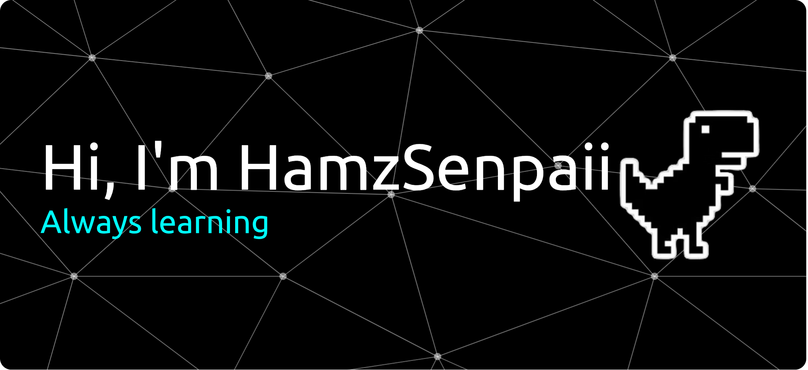

  

I am a creative beginner developer currently learning fullstack development and content creation. I have a strong interest in building websites, bots, and various digital projects while continuously improving my programming and technology skills.

<h2 id="tech-stack" align="left">Tech Stack</h2>

<h3 id="programming-language" align="left">Programming Languages</h3>

<h3 id="frameworks-&-libraries" align="left">Frameworks & Libraries</h3>

<h3 id="tools-i-use" align="left">Tools I Use</h3>

<h2 id="github-stats" align="left">GitHub Stats</h2>

  

  

  

